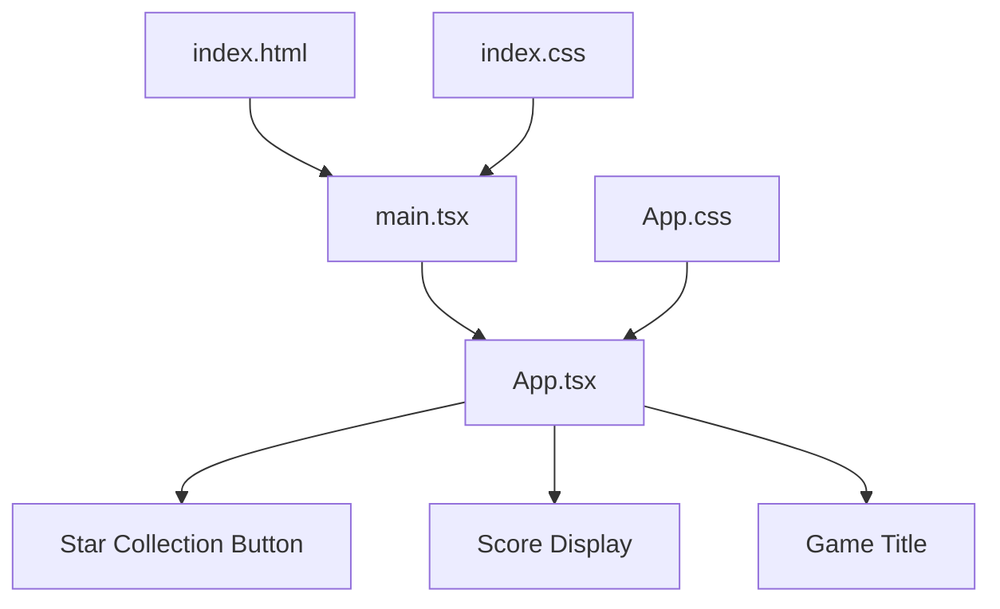
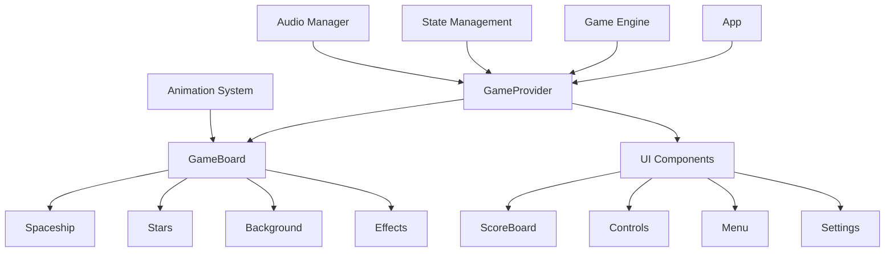

# Architecture Overview 🏗️

## 🎯 Project Structure

```
space-game-1/
├── 📁 .github/          # GitHub Actions workflows
│   └── workflows/
│       ├── deploy-main.yml        # Main branch deployment
│       └── deploy-branch-preview.yml  # Branch preview deployment
├── 📁 docs/             # Documentation
│   ├── ARCHITECTURE.md   # This file
│   ├── API.md           # Component & API docs
│   ├── DEPLOYMENT.md    # Deployment guide
│   └── GAME_FEATURES.md # Game features & roadmap
├── 📁 public/           # Static assets
├── 📁 src/              # Source code
│   ├── App.tsx          # Main application component
│   ├── App.css          # Application styles
│   ├── main.tsx         # Application entry point
│   ├── index.css        # Global styles
│   ├── vite-env.d.ts    # Vite type definitions
│   └── assets/          # Assets (images, etc.)
├── 📄 index.html        # HTML template
├── 📄 package.json      # Dependencies & scripts
├── 📄 vite.config.ts    # Vite configuration
├── 📄 tsconfig.json     # TypeScript configuration
├── 📄 eslint.config.js  # ESLint configuration
├── 📄 README.md         # Main project documentation
└── 📄 CONTRIBUTING.md   # Contribution guidelines
```

## 🧩 Component Architecture

### Current Architecture (v0.0.0)



### Component Hierarchy

```typescript
App (Root Component)
├── GameHeader
│   ├── Title: "🚀 Space Game"
│   └── Subtitle: "Welcome to the Space Adventure!"
├── GameContent
│   ├── ScoreButton: Interactive star collection
│   └── ScoreDisplay: Real-time score updates
└── GameFooter
    └── TechStack: "Built with React, TypeScript, and Vite"
```

### Planned Architecture (v0.2.0)



## ⚛️ React Architecture

### State Management Strategy

#### Current Implementation
```typescript
// Simple local state with useState
const [score, setScore] = useState(0)

// Event handlers
const handleStarClick = () => setScore(score => score + 10)
```

#### Planned Evolution
```typescript
// Phase 1: Enhanced local state
const [gameState, setGameState] = useState({
  score: 0,
  highScore: 0,
  level: 1,
  lives: 3
})

// Phase 2: Context-based state management
const GameContext = createContext()

// Phase 3: Reducer pattern for complex state
const gameReducer = (state, action) => {
  switch (action.type) {
    case 'COLLECT_STAR':
      return { ...state, score: state.score + action.payload }
    case 'LEVEL_UP':
      return { ...state, level: state.level + 1 }
    // ... more actions
  }
}
```

### Component Patterns

#### Current Pattern: Simple Functional Components
```typescript
function App() {
  const [score, setScore] = useState(0)
  
  return (
    <div>
      <h1>🚀 Space Game</h1>
      <button onClick={() => setScore(score + 10)}>
        Collect Star ⭐ (Score: {score})
      </button>
    </div>
  )
}
```

#### Planned Patterns

**Custom Hooks for Game Logic**
```typescript
// Custom hooks for reusable game logic
const useScore = () => {
  const [score, setScore] = useState(0)
  const [highScore, setHighScore] = useLocalStorage('highScore', 0)
  
  const addScore = (points: number) => {
    const newScore = score + points
    setScore(newScore)
    if (newScore > highScore) setHighScore(newScore)
  }
  
  return { score, highScore, addScore }
}

const useGameLoop = (callback: () => void, fps = 60) => {
  useEffect(() => {
    const interval = setInterval(callback, 1000 / fps)
    return () => clearInterval(interval)
  }, [callback, fps])
}
```

**Component Composition**
```typescript
const GameBoard = () => (
  <div className="game-board">
    <Background />
    <Spaceship />
    <StarField />
    <Effects />
  </div>
)

const UI = () => (
  <div className="ui-overlay">
    <ScoreBoard />
    <Controls />
    <Menu />
  </div>
)
```

## 🛠️ Build Architecture

### Vite Configuration

```typescript
// vite.config.ts
export default defineConfig({
  plugins: [react()],
  base: '/space-game-1/',  // GitHub Pages base path
  build: {
    outDir: 'dist',
    sourcemap: true,
    rollupOptions: {
      output: {
        manualChunks: {
          vendor: ['react', 'react-dom']
        }
      }
    }
  },
  server: {
    port: 5173,
    host: true  // For mobile testing
  }
})
```

### Bundle Optimization Strategy

```typescript
// Asset optimization
const images = {
  format: ['webp', 'png'],  // Modern formats first
  sizes: [320, 640, 1280],  // Responsive images
  quality: 80               // Balanced quality/size
}

// Code splitting strategy
const chunks = {
  'game-engine': ['./src/engine/*'],
  'ui-components': ['./src/components/*'],
  'utils': ['./src/utils/*']
}
```

## 🎨 Styling Architecture

### CSS Strategy

#### Current Approach
```css
/* Global styles in index.css */
#root {
  max-width: 1280px;
  margin: 0 auto;
  padding: 2rem;
  text-align: center;
}

/* Component styles in App.css */
.card {
  padding: 2em;
}
```

#### Planned CSS Architecture
```css
/* CSS Custom Properties for theming */
:root {
  --color-primary: #646cff;
  --color-secondary: #61dafb;
  --color-background: #1a1a1a;
  --color-text: #ffffff;
  
  --space-xs: 0.5rem;
  --space-sm: 1rem;
  --space-md: 2rem;
  --space-lg: 4rem;
  
  --font-size-sm: 0.875rem;
  --font-size-base: 1rem;
  --font-size-lg: 1.25rem;
  --font-size-xl: 2rem;
}

/* Mobile-first responsive design */
.game-button {
  min-height: 44px;  /* Touch target minimum */
  touch-action: manipulation;  /* Prevent zoom on iOS */
  
  @media (min-width: 768px) {
    min-height: auto;
  }
}
```

### Styling Conventions
```scss
// BEM methodology for class naming
.game-board {}
.game-board__spaceship {}
.game-board__spaceship--moving {}

// Utility classes for common patterns
.visually-hidden { /* Screen reader only */ }
.no-scroll { /* Prevent body scroll */ }
.fade-in { /* Animation classes */ }
```

## 📱 Mobile Architecture

### Touch Optimization
```typescript
// Touch event handling
const handleTouchStart = (e: TouchEvent) => {
  e.preventDefault() // Prevent default touch behaviors
  // Handle touch start
}

// Performance optimization
const useRAF = (callback: () => void) => {
  useEffect(() => {
    const tick = () => {
      callback()
      requestAnimationFrame(tick)
    }
    requestAnimationFrame(tick)
  }, [callback])
}
```

### Responsive Design Strategy
```css
/* Container queries for component-based responsive design */
.game-container {
  container-type: inline-size;
}

@container (min-width: 768px) {
  .game-board {
    grid-template-columns: 1fr 1fr;
  }
}

/* Mobile-first breakpoints */
$breakpoints: (
  'mobile': 320px,
  'tablet': 768px,
  'desktop': 1024px,
  'wide': 1440px
);
```

## 🚀 Performance Architecture

### Optimization Strategies

#### Bundle Size Optimization
```typescript
// Lazy loading for routes
const GameSettings = lazy(() => import('./components/GameSettings'))
const Leaderboard = lazy(() => import('./components/Leaderboard'))

// Tree shaking optimization
export { GameEngine } from './engine'  // Named exports only
```

#### Runtime Performance
```typescript
// Memoization for expensive calculations
const gameStats = useMemo(() => 
  calculateGameStats(score, level, time), 
  [score, level, time]
)

// Virtualization for large lists
const VirtualizedLeaderboard = () => (
  <FixedSizeList
    height={400}
    itemCount={scores.length}
    itemSize={60}
  >
    {LeaderboardRow}
  </FixedSizeList>
)
```

#### Animation Performance
```css
/* GPU acceleration for animations */
.spaceship {
  transform: translateZ(0);  /* Force hardware acceleration */
  will-change: transform;    /* Optimize for animations */
}

/* Prefer transforms over layout properties */
.star {
  transform: scale(1.2);  /* Not width/height */
  transition: transform 0.2s ease;
}
```

## 🔧 Development Architecture

### Development Tools
```json
{
  "scripts": {
    "dev": "vite",                    // Development server
    "build": "tsc -b && vite build", // Production build
    "preview": "vite preview",        // Preview build
    "lint": "eslint .",              // Code linting
    "lint:fix": "eslint . --fix",    // Auto-fix linting
    "type-check": "tsc --noEmit"     // Type checking only
  }
}
```

### Code Quality
```typescript
// ESLint configuration
export default tseslint.config([
  globalIgnores(['dist']),
  {
    files: ['**/*.{ts,tsx}'],
    extends: [
      ...tseslint.configs.recommended,
      ...tseslint.configs.strict
    ]
  }
])

// TypeScript strict mode
{
  "compilerOptions": {
    "strict": true,
    "noImplicitAny": true,
    "noImplicitReturns": true,
    "noUnusedLocals": true,
    "noUnusedParameters": true
  }
}
```

## 🔄 Data Flow

### Current Data Flow
```
User Click → setState → Re-render → Updated UI
```

### Planned Data Flow
```
User Input → Action → Reducer → State Update → 
Component Re-render → Animation → Audio Feedback
```

### Event System Architecture
```typescript
// Event-driven architecture for game events
type GameEvent = 
  | { type: 'STAR_COLLECTED'; payload: { points: number } }
  | { type: 'LEVEL_COMPLETED'; payload: { level: number } }
  | { type: 'GAME_OVER'; payload: { finalScore: number } }

const useGameEvents = () => {
  const eventBus = useRef(new EventTarget())
  
  const emit = (event: GameEvent) => {
    eventBus.current.dispatchEvent(new CustomEvent(event.type, {
      detail: event.payload
    }))
  }
  
  return { emit, eventBus: eventBus.current }
}
```

## 🏗️ Future Architecture Considerations

### Scalability Planning
- **Micro-frontends**: Separate game modules
- **State Management**: Redux Toolkit or Zustand for complex state
- **Server Integration**: Backend API for multiplayer features
- **Caching Strategy**: Service Worker for offline gameplay

### Technology Evolution
- **Framework Agnostic**: Design patterns that work beyond React
- **Web Standards**: Use Web APIs for better performance
- **Progressive Enhancement**: Core functionality without JavaScript
- **Cross-Platform**: Consider React Native for mobile apps

---

*This architecture is designed to evolve with the game's complexity while maintaining performance and developer experience.* 🚀